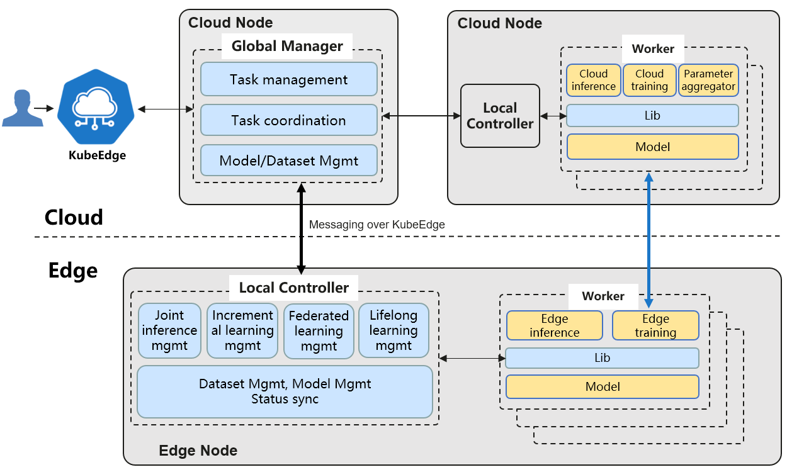

Sedna is an edge-cloud synergy AI project incubated in KubeEdge SIG AI. Benefiting from the edge-cloud synergy capabilities provided by KubeEdge, Sedna can implement across edge-cloud collaborative training and collaborative inference capabilities, such as joint inference, incremental learning, federated learning, and lifelong learning. Sedna supports popular AI frameworks, such as TensorFlow, Pytorch, PaddlePaddle, MindSpore.

Sedna can simply enable edge-cloud synergy capabilities to existing training and inference scripts, bringing the benefits of reducing costs, improving model performance, and protecting data privacy.

For more details: https://sedna.readthedocs.io/en/latest/proposals/architecture.html

Architecture:

### Run installation script

`bash assets/sedna-install.sh create`{{execute HOST1}}

### Restart pods on cloud side which are pending
`kubectl -n kube-system delete pods --field-selector=status.phase=Failed`{{execute HOST1}}
`kubectl -n kube-system delete pods --field-selector=status.phase=Pending`{{execute HOST1}}
